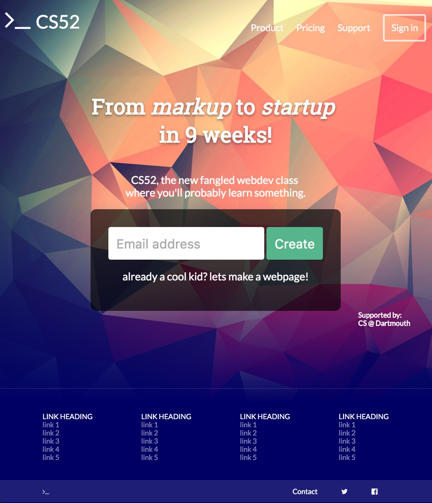
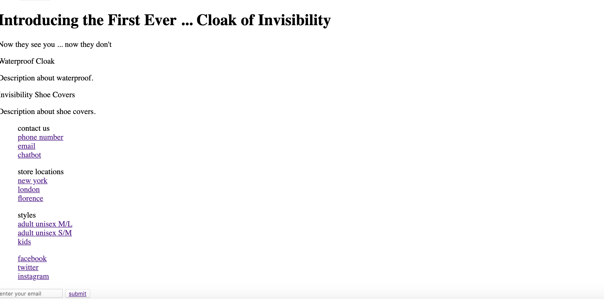
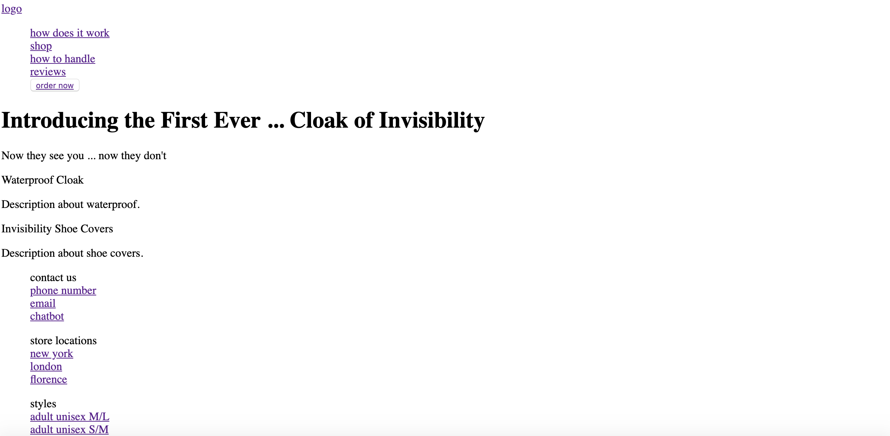

# LAB 1, CS52, Bailey Burke

## Build a Landing Page! 

# My Landing Page: 

[Invisibility Cloaks](https://dartmouth-cs52-19s.github.io/lab1-landingpage-baileyburke/)

### Overview: 
    
   For my webpage, I created a mock website that sells cloaks of invisibility. I based mine off of a mix of two layouts actually, the first being [flourbakery](https://flourbakery.com/), and the other being the image that Professor Tregubov showed as his example (ExampleLab1.jpg): 
   
   
   
   Specifically, I took the nav bar, CTA, and main body from flourbakery, and then the footer and the bottom links from both flourbakery as well as that image from Prof Tregubov's example. Flourbakery had the logo in the top left corner, and then tabs on the top that finally end with the CTA. There was one large background image, and just text on that image. Mine was inspired by that, with my nav bar having a logo on the top left, and then tabs along the top with a CTA button on the top right. Then I had a background image of footprints (signifying that someone is using the cloak and just leaving behind footprints along the beach), with the header text and subheader text on that. Next, if you scroll down on flourbakery, there is a row with special features/other sections of the site, so I decided to add an "accessories" row, showing off two features. Mine was loosely based off of this. Then, finally, for my footer, I took the bottom links idea from Professor Tregubov (in which he implemented headers for each bottom link "group," and then has the links underneath it). The social media logos and sign up button idea is from flourbakery. 

### What worked/didn't work:
 It honestly did take a bit to understand how to structure the HTML so that you could link the CSS with it to work exactly as imagined, but after playing around with it for a bit, it became easier to understand how it works. What helped was first testing things out on the inspector for my webpage on the local server, and then altering it in my code. 
  
  What worked: 
  
* I wanted my bottom links to not have a background color and be part of the footer, and that ended up working out after spending a lot of time on it. I wanted the sections to space out perfectly, so that took some time to figure out, but eventually it worked. 
* I wanted my accessory items to bounce when there is a hover on them, and I eventually got that to work by adding a margin to the top of that flexbox. 
* I got the links/buttons to have the text change color when there is a hover. 
* Something that was really useful was making things that are "grouped together", such as the nav and footer, unsorted lists. That was very helpful and made it easier to style, since then it was possible to give class and ID names to both the overall list, as well as the individual list items. 
* I used flexboxes on most of my major sections/anything that I wanted to be able to properly style, which was very useful. 
        
        
 	
What didn't work: 
 	
* I tried to do a hover { display: none} on the image of someone holding nothing (to imitate it becoming invisible), but for some reason it wouldn't work exactly how I wanted it to. 

### Responsive Resizing: 

   Here are the things I did that change when you shrink my webpage on a desktop:
   
* Most things that are rows change to columns. This was able to fix a good bulk of things for my site. 
* For the nav bar, the main links disappear, and the "order now" button moves to the center so users can always see it/it's never cut off. 
* For the accessories section, the images and descriptions go away, and the main link of the accessory name displays a border now. 
* For the footer, everything becomes a column, and the footer link-group header name displays a border, with its specific links underneath. 
* The bouncing feature on the accessories disappear. 
* The icons and input section become columns as well. 
* Nothing overlaps each other and there are no collisions. 

### My CSS effects: 

* On all of the links/button texts, I have a hover effect which changes the color of the text. 
* Some links display an underline when there is a hover effect. 
* The buttons for my signup + navbar CTA button have a button border radius.
* My nav bar and accessories section has a border on them. 
* My accessories bounce when a user hovers over them. 
* A user would be able to input the email address. 

### Structure Layout Screenshots:

	

### I have attached in my repo: 
    -The image of Professor Tregubov's example
    -My images of the HTML structure layout

Thank you! 